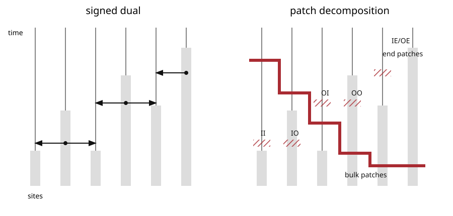

# Patch

Fix the [graphical construction](graphical-construction-of-signed-additive-set-process.md) of a signed additive set process and its all-time [successful-interaction](successful-interaction.md) skeleton $\mathcal I$. The deterministic initial record is $(\infty,0,A_0)$.

A record $(j,t,S)\in\mathcal I$ gives an **incoming** successful interaction at every site in $S$. If $j\ne\infty$, it also gives an **outgoing** successful interaction at its source $j$. Thus the initial record gives only incoming interactions.

For $i\in\Lambda$, put

$$
\mathcal T^{\mathsf I}(i)
=
\{t\ge0:(j,t,S)\in\mathcal I\text{ for some }j,S\text{ with }i\in S\},
$$

$$
\mathcal T^{\mathsf O}(i)
=
\{t>0:(i,t,S)\in\mathcal I\text{ for some }S\},
$$

and $\mathcal T(i)=\mathcal T^{\mathsf I}(i)\cup\mathcal T^{\mathsf O}(i)$. For $s\in\mathcal T(i)$ define

$$
e_i(s)=\inf\{u>s:u\in\mathcal T(i)\},
\qquad \inf\vn=\infty.
$$

## Definition

Let $(j,s,S)\in\mathcal I$ be a record involving $i$, meaning that $i\in S$ or $i=j$. The patch beginning at $(i,s)$ is

$$
P=
\bigl(i(P),[s(P),e(P)),\mathsf X(P)\mathsf Y(P),S(P)\bigr),
$$

where

$$
i(P)=i,
\qquad
s(P)=s,
\qquad
e(P)=e_i(s),
\qquad
S(P)=S.
$$

Its initial label is

$$
\mathsf X(P)=
\begin{cases}
\mathsf I,&i(P)\in S(P),\\
\mathsf O,&i(P)\notin S(P),
\end{cases}
$$

and its terminal label is

$$
\mathsf Y(P)=
\begin{cases}
\mathsf I,&e(P)<\infty\text{ and }e(P)\in\mathcal T^{\mathsf I}(i(P)),\\
\mathsf O,&e(P)<\infty\text{ and }e(P)\in\mathcal T^{\mathsf O}(i(P)),\\
\mathsf E,&e(P)=\infty.
\end{cases}
$$

The six possible boundary types are

$$
\mathsf{II},\ \mathsf{IO},\ \mathsf{IE},
\qquad
\mathsf{OI},\ \mathsf{OO},\ \mathsf{OE}.
$$

Let $\mathcal P$ be the family of all patches. Every patch with terminal label $\mathsf E$ is infinite, and every other full patch is finite.

The successful-interaction skeleton fixes the patch boundaries but deliberately omits death clocks, rings at inactive sources, and the split/birth kind of an outgoing successful interaction. Those omitted marks are averaged under the [consistent patch law](patch-consistency-event.md).

## Finite-horizon truncation

Fix $t\ge0$. For a patch $P\in\mathcal P$ with $s(P)\le t$, let $P^{\downarrow t}$ be obtained by replacing its endpoint by $\min\{e(P),t\}$ and, when $t<e(P)$, replacing its terminal label by $\mathsf E$.

The bulk and end patch families are

$$
\mathcal B_t=\{P\in\mathcal P:e(P)\le t\},
$$

$$
\mathcal E_t
=
\{P^{\downarrow t}:P\in\mathcal P,\ s(P)\le t<e(P)\},
$$

and

$$
\mathcal P_t=\mathcal B_t\cup\mathcal E_t.
$$

The family $\mathcal P_t$ is finite almost surely. Distinct end patches have distinct sites, because the successful-interaction times partition each site line into consecutive intervals.

For compatibility with older notes, one may call

$$
\mathcal C_t=\{P\in\mathcal P:s(P)\le t<e(P)\}
$$

the cut patches. Their truncations are exactly the end patches, but the paper's finite-horizon representation is stated directly using $\mathcal B_t$ and $\mathcal E_t$.

## Geometric extension

If $P$ is an end patch and $u\ge e(P)$ is finite, its geometric extension through time $u$ is

$$
P^{\uparrow u}
=
\bigl(i(P),[s(P),u),\mathsf X(P)\mathsf E,S(P)\bigr).
$$

This changes only the patch shape. It does **not** include the probability that the realized skeleton has no successful interaction in the added interval. Probability-weighted continuation is a separate ingredient in the convergence proof.
