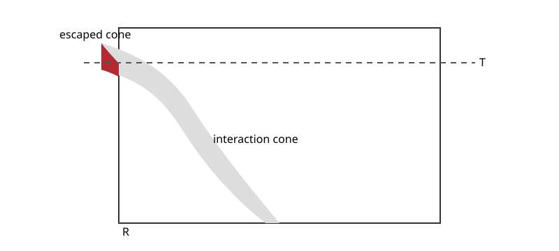

# Spatial confinement of patch weights

This page records the spatial-confinement estimate used in the canonical paper's proof of the common invariant limit. It replaces the older wiki route through a separate modified-process mixing theorem.

Fix $A\Subset\Lambda$. Let

$$
\mathbf{Cone}_T
=
\bigcup_{(i,u,S)\in\mathcal I_T}
(\{i\}\cup S)\setminus\{\infty\}
$$

be the [interaction cone](interaction-cone.md). For $A\subseteq R\Subset\Lambda$, set

$$
E_T^R=\{\mathbf{Cone}_T\subseteq R\}
$$

and

$$
\rho_A(T,R)
=
\left\|(P_T-P_T^{R,0})\chi_A\right\|_\infty,
$$

where $P_t^{R,0}$ is the zero-boundary semigroup on $R$.

Assume the spin system is patch positive and contains a uniform pure-death component. For $\mu\in\mathcal M_*$ define the finite-horizon patch weight

$$
W_t^\mu
=
\prod_{P\in\mathcal B_t}C(P)
\,\mu\left(
\prod_{P\in\mathcal E_t}C(\eta(i(P)),P)
\right),
$$

and the full-patch weight

$$
W
=
\prod_{P\in\mathcal P}C(P)
\mathbf 1_{\{|\mathcal P|<\infty\}}.
$$

## Spatial-confinement lemma

For every $\mu\in\mathcal M_*$,

$$
0
\le
\mathbb E_A\left[W_t^\mu\mathbf1_{(E_T^R)^c}\right]
\le
\rho_A(T,R),
\tag{1}
$$

and

$$
0
\le
\mathbb E_A\left[W\mathbf1_{(E_T^R)^c}\right]
\le
\rho_A(T,R).
\tag{2}
$$

Thus the total patch weight carried by skeletons that leave $R$ before time $T$ is controlled by the error made when replacing the infinite system by its zero-boundary restriction.

By [finite propagation](finite-propagation-for-zero-boundary-restrictions.md), one can choose a directed ball $R_T$ with radius proportional to $T$ so that

$$
\rho_A(T,R_T)\le C_Ae^{-aT}
$$

for any prescribed $a>0$ after choosing the proportionality constant sufficiently large. On a polynomial-growth lattice, $|R_T|$ grows at most polynomially in $T$.

This is the first of the three estimates used in the [common invariant-limit theorem](common-invariant-limit-under-uniform-pure-deaths.md); late successful interactions and no-late-interaction relaxation are treated separately.
